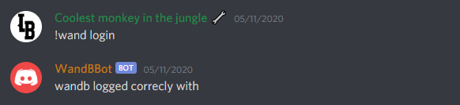
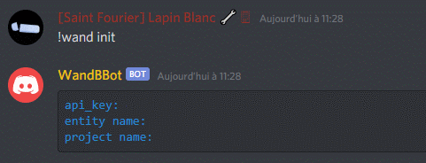
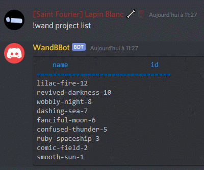
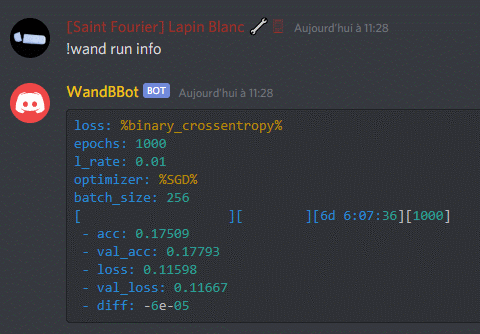

# WandB-discord-bot #
[](https://opensource.org/licenses/MIT)

  
A Weights and Biases bot for discord.  
Made by Alzate_J and @brihoumb.

## Usage: ##
Edit the `config.json` file like following:
```json
{
  "token": "Your discord bot token",
  "prefix": "Prefix to use the bot (default to '!wand ')",
  "API": "Your wandb api (can be set with !wand login)",
  "entity": "Your wandb entity name (can be set with !wand init)",
  "project": "Your wandb targeted project (can be set with !wand init)",
  "runID": "Your wandb run ID (can be set with !wand run info)"
}
```  
Install `python3.6` or higher and the `requirement.txt`.  
Then run `npm start` to start the bot.

## List of commands: ##
``!wand login [API]``  
> Take in parameter your API key then set it in config.json.  
> It return your API_key, the name of your entity and your project selected.  
> 

---

``!wand init [entity] [project]``  
> Take in parameter your entity and project name then set them in config.json.  
> It return your API_key, the name of your entity and your project selected.  
> 

---

``!wand project list``
> List all your runs in the initialised project.  
> Display the name of the run and its ID  
> 

---

``!wand run info [runID]``
> Take in parameter your runID you want to target then set it in config.json.  
> Display all parameters set in your wandb initialisation.  
> Then display the following information [project][id][time running][epoch]
- acc   
- val_acc  
- loss  
- val_loss  
- diff between epoch n and epoch n-1  
>

## Contributing: ##
Feel free to fork or create a pull request of the project.
